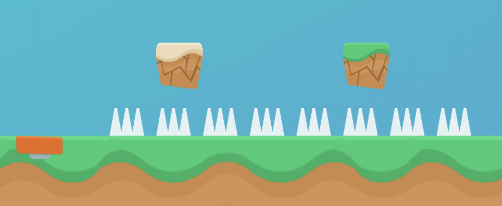

# [Bunny Dash](https://couteaufourchette.github.io/bunnydash/)


## Gameplay

The game is played by pressing the space bar, clicking or touching a phone which triggers a jump on the player. The game is infinite and the player attempts to get the highest score by surviving the longest.

The player can Jump on blocks but will lose if he bumps on the side. He will lose if he collides with the spikes in any way. He will get a larger jump if touches the spring.


## Collision detection

The collision detection happens at every iteration of the loop. The collision is detected by comparing the distance between the two centers and half the width or height of the two objects.

To identify whether the collision was coming from the top or the sides, I normalise the distance with the width or height and check which distance is larger.

``` Javascript
// Getting the distance between the x centers
const xDistance = (objectA.pos[0] + (objectA.width / 2)) - (objectB.pos[0] + (objectB.width / 2));

//Getting half the combined width of the objects
const width = (objectA.width + objectB.width) / 2;

// Comparing the two
Math.abs(xDistance) <= width

// Comparing the normalised x distance to the y distance
if (Math.abs(xDistance) / width) > (Math.abs(yDistance) / height) {
  return 'side';
} else {
  return 'top';
}
```

## Level generation

As this is an infinite game, the level is generated randomly as the player moves. To keep the game playable, the randomness is controlled by creating clusters of objects. Some clusters have an aspect of randomness in their size and can control how long the game should wait until the next cluster appears.

Examples of clusters

### Spring and Jump
The number of jumps after the spring vary from 1 to 6
```javascript

function springAndJump() {
  const numberOfJumps = Math.ceil(Math.random() * 6);
  this.setNextSpawn(numberOfJumps * 50);
  const springs = [this.generateItem('spring', 0)];
  const spikes = [...Array(numberOfJumps * 4).keys()].map(pos => this.generateItem('spike', pos + 2));
  const blocks = [...Array(numberOfJumps).keys()].map(pos => this.generateItem('block_mid', (pos * 4) + 3));
  return [].concat(springs, spikes, blocks);
}

```


### Spring over spikes


### The trap


## A simple AI

There is a simple AI that simulates the next Jump and only jumps when the jump will not lead to a death. The simulation is only played when there are obstacles near the bot. The simulation runs until the jump is done or the player has lost. 

There are currently two ways the bot will lose. The first one is when the jump will be successful but the next jump will lead to a loss. The second is when the frame rate is reduced as the simulation is executated at a perfect frame rate.

## Next steps
- Creating a game delta to seperate game logic from frame rate
- Improve the bot to account for possibilities after the first jump